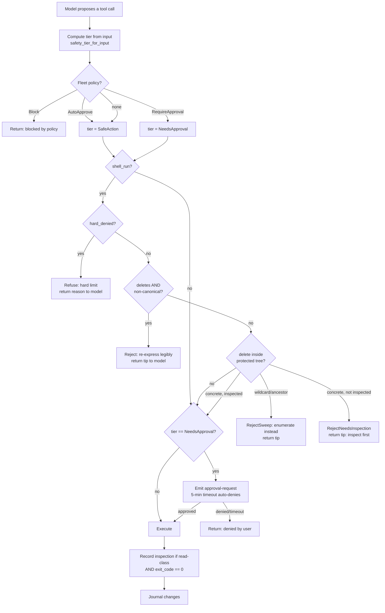

# The Safety Harness

Noah points a language model at a broken Mac and lets it run real commands. The model is not trusted to be safe. It is trusted only to *propose*. Every proposal passes through a harness written in Rust — the orchestrator and the `safety` module — that decides what actually executes. The prompt can be jailbroken; the harness cannot be talked out of its verdict, because the verdict is code, not text.

Stated precisely: **the model has a tool vocabulary and may propose anything expressible in it; the harness holds a set of independent gates between a proposal and its execution.** Each gate blocks a distinct class of harm, and a proposal must clear all of them. This document walks the gates in the order the code applies them, quotes what each one checks, and is explicit about what it does *not* cover. It describes the macOS implementation — the enforced layers live in `crates/noah-tools/src/safety.rs`, `crates/noah-tools/src/types.rs`, `apps/desktop/src-tauri/src/platform/macos/diagnostics.rs`, and `execute_tool` in `apps/desktop/src-tauri/src/agent/orchestrator.rs`. Where this document says "the harness enforces X," X is a `#[test]`-covered branch in that code, not a prompt instruction.

---

## Threat model

The harness defends against three things, in rough order of how much of the design they drive:

1. **A well-meaning model that is wrong.** The dominant case. The model believes a command is safe, is fluent in shell, and is confidently mistaken — a wildcard that matches more than it thinks, a cache-clearing `rm` whose path also contains the user's Messages database, a "cleanup" that resolves to `$HOME`. The precedent incident (see `safety.rs` test module, "The incident commands") is exactly this: plausible `rm -rf` invocations over `~/Library` trees that would destroy irreplaceable data. Most of the safety module exists to make this class *hard to express by accident and impossible to execute without inspection*.

2. **A model that has been steered adversarially.** Prompt injection from file contents, a log line, or a web page the model read could try to smuggle a destructive command through. The harness assumes the *text* reaching the model may be hostile. Its defense is that no amount of persuasion changes the Rust: a command is classified by parsing the string it would run, not by what the model claims the command does.

3. **Irrecoverable machine-ending actions, from any source.** A small floor of operations — wiping the OS, erasing a disk, deleting the Keychain — are refused categorically. Not gated, not approvable: refused, even if the user (or the model on the user's behalf) reaffirms.

Explicit non-goals — things the harness does **not** claim to stop:
- It is **not a sandbox.** Approved commands run with the user's real privileges (and, for `sudo`, escalated ones via the native auth dialog). The harness decides *whether* a command runs; it does not contain *what a running command can touch*.
- It does **not** model full shell semantics. It is a deliberately conservative *approximation* of what a command would delete (`safety.rs` documents its own known limits). The design compensates by **failing closed**: anything it cannot read statically, it refuses rather than guesses.

---

## The layers

The model's boundary is the `Tool` trait (`crates/noah-tools/src/tool.rs`). Each tool declares a base safety tier and, optionally, a tier that depends on the specific input:

```rust
pub trait Tool: Send + Sync {
    fn name(&self) -> &str;
    fn description(&self) -> &str;
    fn input_schema(&self) -> Value;
    fn safety_tier(&self) -> SafetyTier;

    /// Determine the safety tier based on the specific input.
    fn safety_tier_for_input(&self, _input: &Value) -> SafetyTier {
        self.safety_tier()
    }

    async fn execute(&self, input: &Value) -> Result<ToolResult>;
}
```

### Layer 0 — Safety tiers, classified from the input

The tier vocabulary is three values (`crates/noah-tools/src/types.rs`):

```rust
pub enum SafetyTier {
    ReadOnly,
    SafeAction,
    NeedsApproval,
}
```

A tier is not a fixed property of a tool — it can depend on the *arguments*. `shell_run` is the load-bearing case. Its base tier is `SafeAction`, but it overrides `safety_tier_for_input` to promote dangerous invocations to `NeedsApproval` (`diagnostics.rs`):

```rust
fn safety_tier_for_input(&self, input: &Value) -> SafetyTier {
    if let Some(command) = input.get("command").and_then(|v| v.as_str()) {
        if is_dangerous_command(command) {
            return SafetyTier::NeedsApproval;
        }
    }
    SafetyTier::SafeAction
}
```

`is_dangerous_command` is a case-insensitive scan for a fixed pattern set (`DANGEROUS_COMMAND_PATTERNS`): file deletion (`rm `, `rmdir `), privilege escalation (`sudo `), raw disk ops (`dd `, `mkfs`, `diskutil erase`), power state (`shutdown`, `reboot`, `halt`, `poweroff`), device writes (`> /dev/`), broad permission changes (`chmod -R`, `chmod 777`, `chown -R`), pipe-to-shell (`| sh`, `| bash`, `| zsh`), service and process control (`launchctl unload`, `killall `, `pkill `), and `truncate `. Anything matching is forced to `NeedsApproval` — a human must approve it before it runs.

**What this blocks:** the entire dangerous-command class is prevented from auto-executing. It does *not* block by itself — it routes to human approval (Layer 3). This is a coarse net, intentionally over-inclusive (`ls` never matches; `rm ` always does).

A second, narrower tier lives inside `mac_read_file`: an allow/deny path list (`ALLOWED_PATH_PREFIXES` / `FORBIDDEN_PATH_PREFIXES`) that refuses reads of `/System/`, `/private/var/db/`, `/private/var/root/`, and similar, independent of tier. It is a read-scope guard, not a deletion guard, and is mentioned here for completeness.

### Layer 1 — Fleet policy override (managed installs)

Before any tier decision is acted on, the orchestrator consults an optional fleet policy (`execute_tool`, `orchestrator.rs`). If an administrator has defined a rule for this tool + input, it can force one of three effects:

```rust
match effect {
    SafetyEffect::Block        => return Ok("Action blocked by fleet policy. ..."),
    SafetyEffect::AutoApprove  => tier = SafetyTier::SafeAction,   // skip approval
    SafetyEffect::RequireApproval => tier = SafetyTier::NeedsApproval,
}
```

**What this blocks / allows:** an admin can hard-block a tool for a fleet, or relax approval for a trusted one. Crucially, `AutoApprove` only lowers the *approval* tier — it is applied *before* the deletion gate below and does **not** exempt a command from the redline gate or the hard-deny floor. A fleet cannot auto-approve its way past `rm -rf /`.

### Layer 2 — The inspect-before-delete redline gate

This is the core of the harness and the reason the incident class described in [the safety policy](../../apps/desktop/src-tauri/docs/safety-policy.md) cannot recur. It lives in `crates/noah-tools/src/safety.rs` as a **pure, deterministic** function: given the command string, the user's home dir, and the set of paths already inspected this session, it returns a verdict. State (what's been inspected) lives in the orchestrator; the classifier itself is stateless. The gate runs for `shell_run` only, and it runs regardless of tier.

The verdict type (`safety.rs`):

```rust
pub enum GateDecision {
    Allow,
    RejectNonCanonical    { tip: String },
    RejectNeedsInspection { path: String, tip: String },
    RejectSweep           { tree: String, tip: String },
    HardDeny              { reason: String },
}
```

`gate_decision` applies these in a fixed order. Each sub-layer blocks a distinct thing.

**2a. The hard-deny floor — refused even if reaffirmed.** `hard_denied()` runs first. It normalizes every delete target the command would touch and refuses categorically if the target is the OS or the user's whole world:

- Root and system trees: `/`, `/System` (and below), `/usr` (and below), `/Users`, `/Library`, or the home directory itself.
- Identity/credential stores: `~/Library/Keychains`, anything containing `com.apple.tcc` or `com.apple.security`.
- Whole-disk erase: a `diskutil` invocation containing `eraseDisk`, `eraseVolume`, `secureErase`, or `zeroDisk`.

There is no code path that clears a `HardDeny`. The test `keychain_hard_denied_even_if_inspected` asserts that inspecting the Keychain first does *not* unlock deleting it. This is the one place the harness says "no" and means it unconditionally.

**2b. Canonical-form allowlist — fail closed.** If the command deletes at all (`mentions_deletion`) but not in a form the harness can fully read, it is rejected as `RejectNonCanonical`. The harness only runs deletions whose target is *statically visible*. Rejected forms include:

- pipes (`… | xargs rm`, `… | sh`) — a filter in the pipeline could diverge the deleted set from anything checkable;
- command substitution `$(...)` and backticks;
- shell variables other than `$HOME`;
- relative paths and `.`/`..` segments (the `cd ~ && rm -rf Library/...` bypass);
- `eval`, and deletes laundered through a nested `sh -c`/`bash -c`/`zsh -c`;
- wrapper prefixes that hide the operand (`command rm`, `env FOO=1 rm`, `nice -n 10 rm`, a `VAR=1` assignment prefix);
- the indirection/secure deleters `xargs`, `srm`, `shred`, `rmdir`, and long-form flags like `--no-preserve-root`.

The permitted forms are exactly two: a plain `rm`/`unlink` on an absolute or `~`/`$HOME`-rooted operand, and a **non-piped** `find <literal-root> … -delete`/`-exec rm` whose root is statically checkable. The rejection carries a `tip` telling the model how to re-express the command legibly. This is the mechanism that neutralizes the adversarial-steering threat: obfuscation does not slip past, it bounces back as "re-express this so I can read it."

**2c. Protected-tree gate — inspect before delete.** For a canonical delete, each target is checked against `PROTECTED_TREES` — a tilde-rooted list tracking Apple's TCC-protected locations (Documents, Desktop, Downloads, Pictures, Movies, Music, Mail, Messages, Safari, Calendars, iCloud/`Mobile Documents`, `CloudStorage`, Photos, Containers, Application Support, Group Containers) plus credential stores (`~/.ssh`, `~/.gnupg`, `~/.aws`, `~/.kube`, `~/.docker`, `~/.config`). If a delete touches one of these:

- **Wildcard or ancestor → `RejectSweep`.** A glob (`~/Library/Application Support/*`) or a delete of the tree root or an ancestor of it is an unbounded sweep. It *never* auto-clears, even after inspection (`wildcard_never_clears_even_after_inspection`). The model must enumerate specific subdirectories instead.
- **Concrete, uninspected path → `RejectNeedsInspection`.** A specific subdir (`~/Library/Containers/com.apple.MobileSMS`) is held back until it has been *looked at* this session. The tip instructs the model to `ls`/`du` it first, confirm what it is, then retry the exact delete.
- **Concrete, inspected path → `Allow`.** Once a read-class command has recorded the path (or an ancestor within the same tree) as inspected, the delete clears the gate.

A narrow exemption: a delete strictly inside an *app-state* tree (not a user-content tree) whose path contains a regenerable hint (`/caches/`, `/cache/`, `/logs/`, `/.cache/`) is treated as regenerable and not gated. The `content` flag on each `ProtectedTree` is what prevents this exemption from applying to a folder literally named "cache" under `~/Documents` (test `cache_named_folder_under_documents_not_exempt`).

**Anti-bypass normalization.** Before comparison, every path is normalized (`norm`): home-expanded, lowercased (macOS volumes are case-insensitive by default), firmlink-stripped, and dot-collapsed. The firmlink strip is load-bearing: every user path is *also* addressable under `/System/Volumes/Data/…` (same inode, confirmed against `/usr/share/firmlinks`), so `strip_firmlink` removes that prefix and the long spelling gates identically to the short one (`firmlink_wildcard_rejected`, and `firmlink_inspection_clears_firmlink_delete` — inspect short, delete long, still cleared because it's the same location).

**What counts as inspection.** `inspected_paths()` extracts the operands of non-destructive read-class commands — `ls du find stat cat file tree head tail wc grep` — and returns them normalized for the orchestrator to remember. A `find … -delete` is a delete, not a look, and records nothing (`destructive_find_does_not_count_as_inspection`). The inspected set is only updated on **successful** execution (see Layer 4).

### Layer 3 — Human approval round-trip

After the gate allows a command, the tier is honored. A `NeedsApproval` tool blocks on the user (`request_approval`, `orchestrator.rs`): the orchestrator mints an approval id, registers a one-shot channel, and emits an `approval-request` event to the frontend carrying the tool name, description, the parameters, and the model-authored `reason` — the plain-language "what and why" that `shell_run`'s schema *requires* the model to write for a non-technical reader.


The wait has a hard timeout:

```rust
let approved = match tokio::time::timeout(std::time::Duration::from_secs(300), rx).await {
    Ok(result) => result.unwrap_or(false),
    Err(_) => { /* clean up pending approval, emit approval-timeout */ false }
};
```

**What this blocks:** anything `NeedsApproval` — every dangerous command from Layer 0, plus anything a fleet forced to require approval. Silence is denial: after five minutes with no response the request auto-denies (`false`) and the frontend is told to dismiss the modal. A denial returns `"Action denied by user."` to the model as the tool result.

Note the layers compose: an inspected, canonical delete inside a protected tree clears Layer 2 as `Allow` — and then *still* hits Layer 3, because `rm ` is a dangerous pattern and the tier is `NeedsApproval`. Passing the redline gate is not a license to run; it makes a command *eligible* to be shown to the user for approval.

### Layer 4 — Execute, then record

Only after all gates pass does `tool.execute()` run. Two things happen afterward:

- **Inspection is recorded — but only on success.** If the command was a read-class observation *and* exited `0`, its paths are folded into the session's inspected set. A failed `ls` (TCC denial, missing path, timeout) proves nothing about what Noah saw, so it does not unlock a later delete:

```rust
let succeeded = tool_result.data.get("exit_code").and_then(|v| v.as_i64()) == Some(0);
if succeeded {
    let paths = noah_tools::safety::inspected_paths(command, &home);
    // … insert into per-session inspected set …
}
```

- **Changes are journaled.** Any `ChangeRecord`s the tool returns are written to the session journal (`journal::record_change`).

---

## The enforcement point

Everything above is orchestrated by one function — `execute_tool` in `orchestrator.rs`. It is the single choke point every model proposal flows through. Its shape, in order:

1. **Resolve the tool** from the router (unknown tool → error).
2. **Compute the base tier** via `tool.safety_tier_for_input(tool_input)` (Layer 0).
3. **Apply fleet policy** — `Block` returns immediately; `AutoApprove`/`RequireApproval` mutate `tier` (Layer 1).
4. **Run the redline gate** (`shell_run` only, any tier):

```rust
if tool_name == "shell_run" {
    if let Some(command) = tool_input.get("command").and_then(|v| v.as_str()) {
        let home = std::env::var("HOME").unwrap_or_default();
        let decision = {
            let map = self.inspected_paths.lock().await;
            let set = map.get(session_id).unwrap_or(&empty);
            noah_tools::safety::gate_decision(command, &home, set)
        };
        if decision.is_rejection() {
            // … emit a `safety_gate` debug event …
            return Ok(decision.message());   // ← the tip goes back to the model
        }
    }
}
```

5. **Approval gating** — if `tier == NeedsApproval`, call `request_approval`; on denial return `"Action denied by user."` (Layer 3).
6. **Execute** the tool.
7. **Record inspection** from successful read-class commands (Layer 4).
8. **Journal** any changes.

The ordering matters and is deliberate: hard-deny and the fail-closed allowlist are evaluated *before* the approval prompt, so a machine-ending command is never even offered to the user for approval — it is refused with an explanation. Fleet `AutoApprove` is evaluated *before* the gate, so it cannot smuggle a delete past inspection.

### The clean LLM boundary

The single most important framing: **a rejected command is not silently swallowed — it is returned to the model as the tool's result, with a tip on how to proceed correctly.** Every rejection branch (`RejectNonCanonical`, `RejectNeedsInspection`, `RejectSweep`) carries a `tip`, and `execute_tool` returns `decision.message()` — that tip — as the tool output. A hard-deny returns its `reason`. A user denial returns `"Action denied by user."`

The model therefore experiences the harness not as a wall but as a redirect: *"that form can't be read — re-express it as a plain `rm <path>`"*, or *"inspect that folder first, then retry this exact delete."* The correct next action is always legible from the rejection. The safety layer and the model's competence are decoupled: the harness never depends on the model behaving, and the model is never left guessing why nothing happened.

---

## Decision flow



---

## Limitations

The harness is a set of guardrails, not a proof of safety.

- **`shell_run` has no true undo.** The tool returns a `ChangeRecord`, but for shell commands its `undo_tool` is the empty string and `undo_input` is `null` (`diagnostics.rs`) — the journal records *that* a command ran, not a way to reverse it. Reversibility is tool-specific; a deletion is permanent. The gate's job is to make sure a deletion is inspected and approved *before* it happens, precisely because it cannot be taken back after.

- **The classifier is an approximation, and says so.** `safety.rs` documents its own blind spots: a relative path after an *un-tracked* `cd` is not resolved to home, and variable expansion beyond `$HOME` is not modeled. The mitigation is structural, not exhaustive: both of those forms are *rejected as non-canonical* rather than executed, so the blind spot fails closed. But the general principle holds — a sufficiently novel obfuscation the parser doesn't recognize as a deletion would bypass the deletion gate. The canonical-form allowlist exists to shrink that surface to "forms the harness can fully read."

- **The redline gate covers deletions via `shell_run`, not all destructive acts.** A dangerous-but-non-deleting command — `dd`, `chmod -R`, `killall`, `launchctl unload` — is caught by Layer 0 and routed to human approval, but it is *not* subject to inspect-before-delete or the hard-deny floor (except `diskutil erase*`, which is hard-denied). For those, the last line of defense is the approval gate itself: the command is held until a human approves the model's plain-English reason for it. The raw command string is not shown in the modal — it is recorded in the session journal/logs — so the defense is the deliberate decision to approve, not the user visually inspecting the command.

- **It is not containment.** Once approved, a command runs with full user (or admin) privileges and can do anything that command can do. The harness governs the decision to run, not the blast radius of running. There is no sandbox, no filesystem jail, no capability drop.

- **`is_dangerous_command` is a substring net.** It is intentionally over-inclusive (safe by default), but pattern-based classification can be fooled by unusual spacing or encodings; it is a routing heuristic for the approval tier, not a security boundary. The security boundaries are the deterministic `gate_decision` verdicts and the human at the approval modal.

In summary: the harness makes the *common, plausible-but-wrong* destructive action require inspection and approval, makes a small set of *catastrophic* actions impossible, and makes *obfuscated* deletions bounce back for re-expression — while leaving the user's explicit, inspected, approved intent free to execute. It reduces risk to a reviewed decision. It does not eliminate it.
